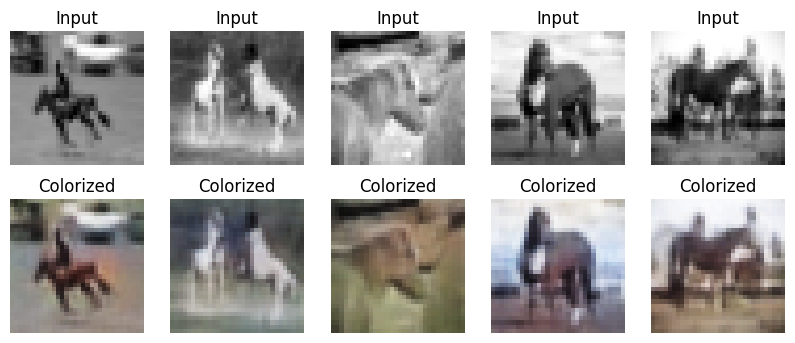
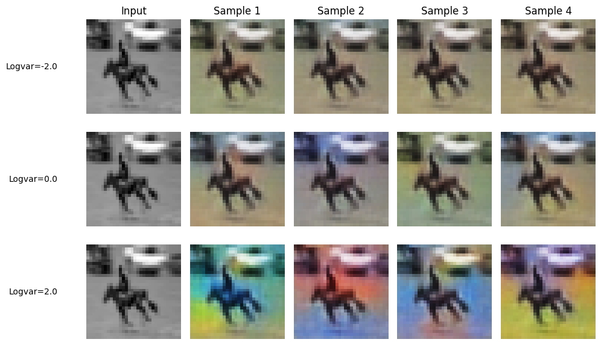

# Image Colorization with Autoencoders

Generative computer-vision workflow for grayscale-to-color image colorization using convolutional autoencoders, U-Net-style models, and conditional variational autoencoders.

## Preview

**Figure 1.** Grayscale horse inputs, ground-truth color images, and generated colorized outputs.

**Figure 2.** CVAE sampling diversity under different latent-variance settings.

## Project summary

This project frames image colorization as a generative learning problem: given a grayscale image, predict plausible RGB color at each pixel. The notebook starts with convolutional autoencoders for regression-style colorization, then compares architectural and training changes including U-Net-style models and conditional variational autoencoders.

## Problem

This project aims to build models that perform image colourization:

> Given a greyscale image, predict the colour at each pixel. The task is difficult because it is ill-posed: a single greyscale image can have multiple equally valid colourings.

The workflow uses CIFAR-10 to keep training manageable, begins with convolutional autoencoders, then compares that approach with conditional variational autoencoders. It also emphasizes data cleaning, architecture selection, hyperparameter tuning, qualitative comparison of generated images, and discussion of ambiguity in generative vision tasks.

## Data

- CIFAR-10 image dataset with 50,000 training and 10,000 test images
- subset focused on horse images for the main colorization experiments
- processed training subset of 5,000 images and test subset of 1,000 images
- grayscale input images paired with RGB target images
- `colourized.npz` containing 302 generated colorized outputs with shape `32 x 32 x 3`

## Techniques

- RGB-to-grayscale preprocessing
- convolutional regression for pixel-level color prediction
- encoder-decoder autoencoder architecture
- U-Net-style colorization model
- conditional variational autoencoder
- KL-divergence and reconstruction-loss tradeoff
- beta and learning-rate experiments for CVAE behavior
- qualitative image-grid evaluation

## Achievements

- prepared CIFAR-10 colorization data by converting RGB images into grayscale inputs and RGB targets
- trained baseline convolutional colorization models and compared outputs across epoch counts
- improved colorization quality with U-Net-style modeling and batch-size experiments
- implemented a CVAE that returns colorized output, latent mean, latent log-variance, and multiple stochastic samples
- compared CVAE sampling diversity under different `logvar`, beta, and learning-rate settings
- identified instability in high-learning-rate CVAE training, including exploding and `nan` losses
- saved 302 generated colorized samples into `colourized.npz`

## Repository structure

| File | Role |
| --- | --- |
| `EdwinXu_A3.ipynb` | Main image-colorization notebook |
| `EdwinXu_A3.html` | Rendered notebook report |
| `colourized.npz` | Saved generated colorized image outputs |
| `preview_colorized_outputs.png` | Grayscale input and predicted colorization examples |
| `preview_cvae_sampling_diversity.png` | CVAE sample diversity under different latent variance settings |

## Skills practiced

This project practices generative computer vision, convolutional autoencoders, U-Net-style image restoration, CVAE sampling, image preprocessing, and qualitative model evaluation.
